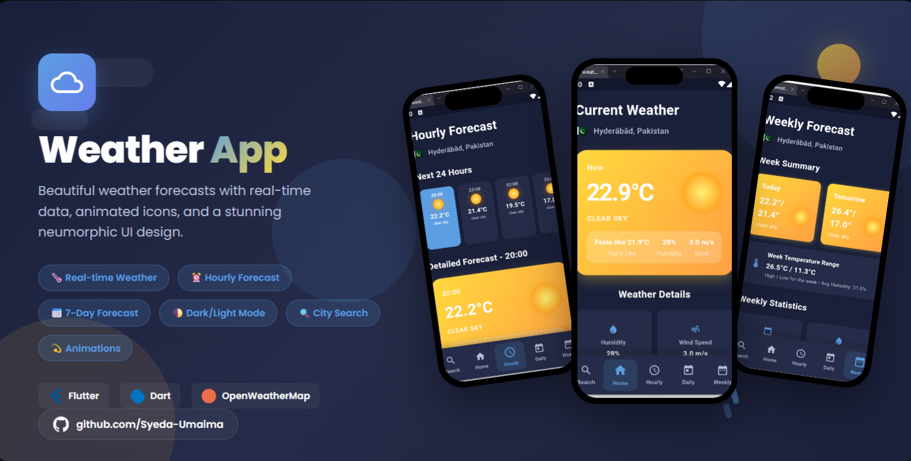
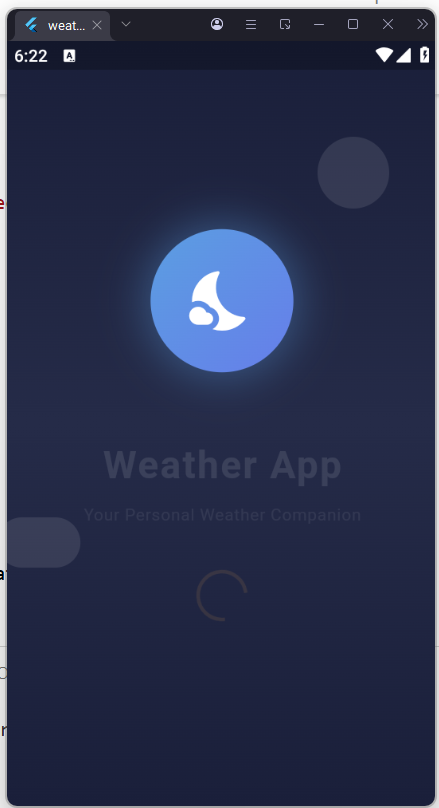
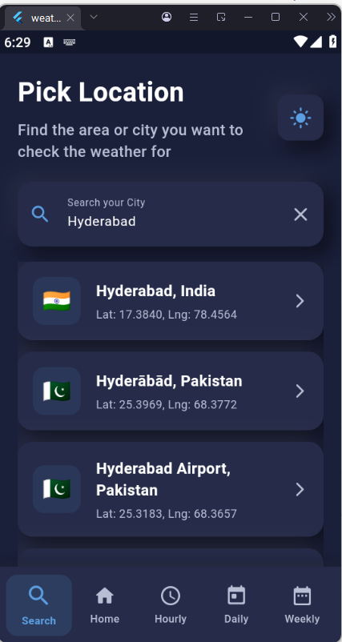
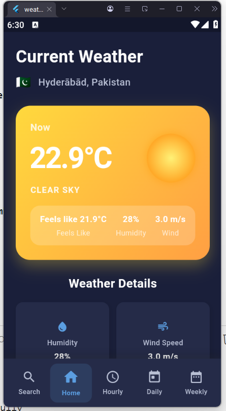
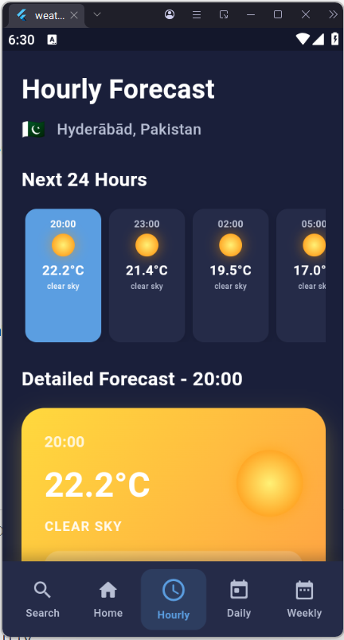
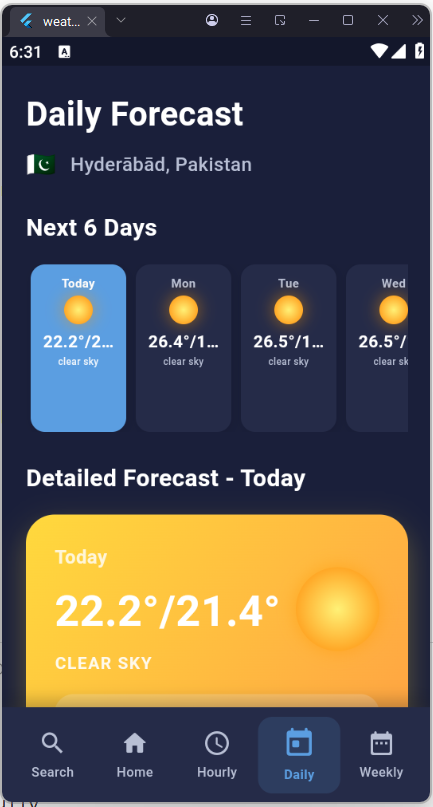
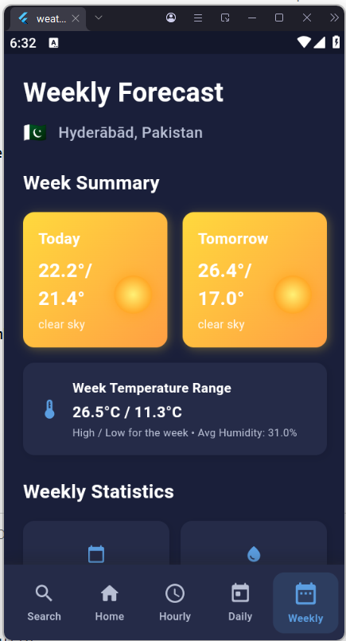
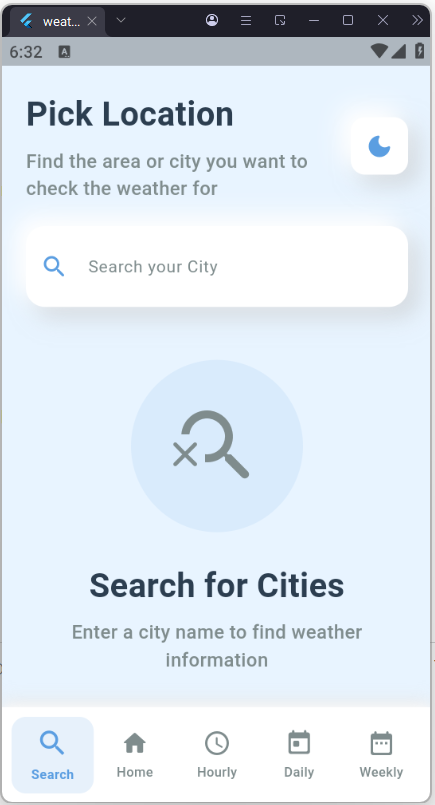
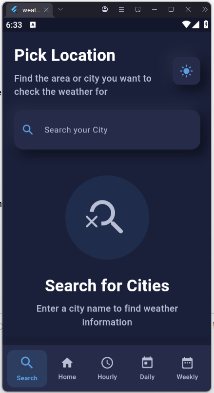

# 🌤️ Weather App

<div align="center">



**A beautiful, feature-rich weather application built with Flutter**

[](https://flutter.dev)
[](https://dart.dev)
[](https://openweathermap.org)
[](LICENSE)

[Features](#-features) • [Screenshots](#-screenshots) • [Installation](#-installation) • [Configuration](#%EF%B8%8F-configuration) • [Architecture](#-architecture)

</div>

---

## 📋 Overview

**Weather App** is a modern, beautifully designed weather application that provides real-time weather information with an elegant neumorphic UI. Search for any city worldwide and get current conditions, hourly forecasts, daily forecasts, and weekly predictions.

---

## ✨ Features

| Feature | Description |
|---------|-------------|
| 🔍 **City Search** | Search any city globally with auto-suggestions |
| 🌡️ **Current Weather** | Real-time temperature, humidity, wind, and conditions |
| ⏰ **Hourly Forecast** | 24-hour weather predictions with 3-hour intervals |
| 📅 **Daily Forecast** | Day-by-day weather for planning ahead |
| 📊 **Weekly Overview** | Full 7-day weather forecast |
| 🎨 **Animated Icons** | Beautiful animated weather icons (sun, clouds, rain, snow) |
| 🌓 **Dark/Light Mode** | Toggle between themes with smooth transitions |
| 💫 **Splash Screen** | Animated splash with weather-themed elements |
| 📱 **Neumorphic UI** | Modern soft-shadow design language |

---

## 📱 Screenshots

<div align="center">

| Splash | Search | Home |
|:------:|:------:|:----:|
|  |  |  |

| Hourly | Daily | Weekly |
|:------:|:-----:|:------:|
|  |  |  |

| Light Theme | Dark Theme |
|:-----------:|:----------:|
|  |  |

</div>

---

## 🚀 Installation

### Prerequisites
- Flutter SDK 3.0+
- Dart SDK 3.0+
- OpenWeatherMap API Key (free)
- GeoNames Username (free)

### Steps

```bash
# Clone the repository
git clone https://github.com/Syeda-Umaima/weather_app.git
cd weather_app

# Install dependencies
flutter pub get

# Run the app (see Configuration section for API keys)
flutter run \
  --dart-define=OPENWEATHER_API_KEY=your_api_key \
  --dart-define=GEONAMES_USERNAME=your_username
```

---

## ⚙️ Configuration

This app requires API keys to fetch weather data. **API keys are NOT stored in the code** for security.

### Getting API Keys

1. **OpenWeatherMap API Key** (Free)
   - Go to [openweathermap.org/api](https://openweathermap.org/api)
   - Sign up for a free account
   - Navigate to "API Keys" tab
   - Generate a new API key

2. **GeoNames Username** (Free)
   - Go to [geonames.org/login](https://www.geonames.org/login)
   - Create a free account
   - Enable free web services in account settings

### Running with API Keys

```bash
# Method 1: Command line (recommended for development)
flutter run \
  --dart-define=OPENWEATHER_API_KEY=your_openweather_key \
  --dart-define=GEONAMES_USERNAME=your_geonames_username

# Method 2: VS Code launch.json
# Add to .vscode/launch.json:
{
  "configurations": [
    {
      "name": "weather_app",
      "request": "launch",
      "type": "dart",
      "args": [
        "--dart-define=OPENWEATHER_API_KEY=your_key",
        "--dart-define=GEONAMES_USERNAME=your_username"
      ]
    }
  ]
}

# Method 3: Build for release
flutter build apk \
  --dart-define=OPENWEATHER_API_KEY=your_key \
  --dart-define=GEONAMES_USERNAME=your_username
```

---

## 🏗️ Architecture

```
lib/
├── main.dart                    # Entry point with splash & navigation
├── Core/
│   ├── constants/
│   │   ├── api_constants.dart   # API URLs & secure key handling
│   │   └── app_constants.dart   # Theme colors, strings, styles
│   ├── utils/
│   │   ├── country_helper.dart  # Country code to emoji flags
│   │   └── date_helper.dart     # Date formatting utilities
│   └── widgets/
│       ├── animated_weather_icon.dart  # Animated weather icons
│       ├── error_widget.dart    # Error state display
│       ├── loading_widget.dart  # Loading indicators
│       ├── neumorphic_card.dart # Neumorphic UI components
│       └── splash_screen.dart   # Animated splash screen
├── Data/
│   ├── models/
│   │   ├── city_model.dart      # City search result model
│   │   ├── weather_model.dart   # Current weather model
│   │   ├── hourly_weather_model.dart
│   │   ├── daily_weather_model.dart
│   │   └── weekly_weather_model.dart
│   ├── repositories/
│   │   ├── city_repository.dart     # City data operations
│   │   └── weather_repository.dart  # Weather data operations
│   └── services/
│       ├── city_api_service.dart    # GeoNames API calls
│       └── weather_api_service.dart # OpenWeatherMap API calls
└── Presentation/
    ├── screens/
    │   ├── search_screen.dart   # City search screen
    │   ├── home_screen.dart     # Current weather display
    │   ├── hourly_screen.dart   # Hourly forecast
    │   ├── daily_screen.dart    # Daily forecast
    │   └── weekly_screen.dart   # Weekly forecast
    └── widgets/
        ├── bottom_nav_bar.dart  # Custom navigation bar
        ├── city_list_item.dart  # City search result item
        └── weather_card.dart    # Weather info card
```

---

## 🛠️ Tech Stack

| Category | Technology |
|----------|------------|
| **Framework** | Flutter 3.0+ |
| **Language** | Dart 3.0+ |
| **Weather API** | OpenWeatherMap (Free tier) |
| **City Search API** | GeoNames (Free tier) |
| **HTTP Client** | http package |
| **UI Design** | Neumorphic / Material Design 3 |
| **Security** | Environment variables via dart-define |

---

## 🌈 Weather Icons

The app features custom animated weather icons:

| Icon | Condition | Animation |
|:----:|-----------|-----------|
| ☀️ | Sunny/Clear | Rotating glow |
| ☁️ | Cloudy | Floating bounce |
| 🌧️ | Rainy | Falling raindrops |
| ❄️ | Snowy | Falling snowflakes |
| ⛈️ | Stormy | Flashing lightning |
| 🌙 | Night | Pulsing glow |

---

## 🔐 Security

This app follows security best practices:

- ✅ API keys are **NOT** hardcoded in source code
- ✅ Uses `--dart-define` for compile-time configuration
- ✅ `.gitignore` excludes all sensitive files
- ✅ Example `.env.example` provided for reference
- ✅ API key validation on startup

---

## 🚀 Future Enhancements

- [ ] GPS-based current location weather
- [ ] Weather notifications & alerts
- [ ] Offline caching with local storage
- [ ] Weather widgets for home screen
- [ ] Multiple saved locations
- [ ] Weather maps integration
- [ ] Air quality index (AQI)
- [ ] Sunrise/sunset times

---

## 🤝 Contributing

Contributions are welcome! Please:

1. Fork the project
2. Create your feature branch (`git checkout -b feature/AmazingFeature`)
3. Commit your changes (`git commit -m 'Add AmazingFeature'`)
4. Push to the branch (`git push origin feature/AmazingFeature`)
5. Open a Pull Request

---

## 📄 License

This project is licensed under the MIT License - see the [LICENSE](LICENSE) file for details.

---

## 👨‍💻 Author

**Syeda Umaima** — [@Syeda-Umaima](https://github.com/Syeda-Umaima)

---

<div align="center">

⭐ **Star this repo if you found it helpful!**

Made with ❤️ and Flutter

</div>